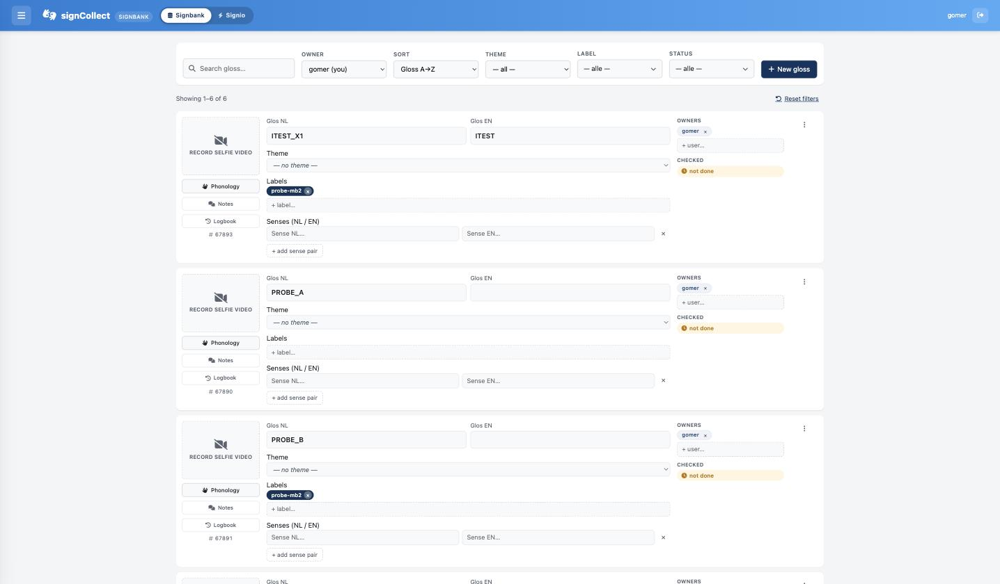
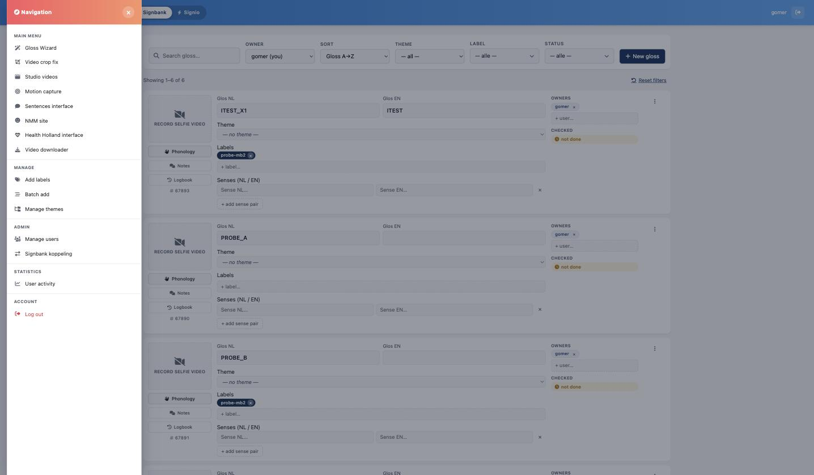
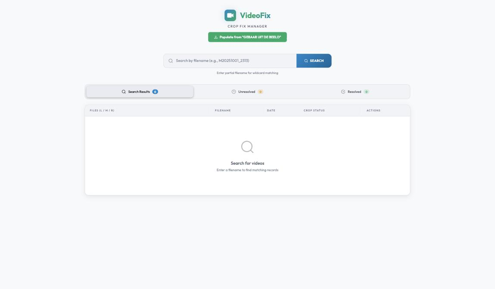
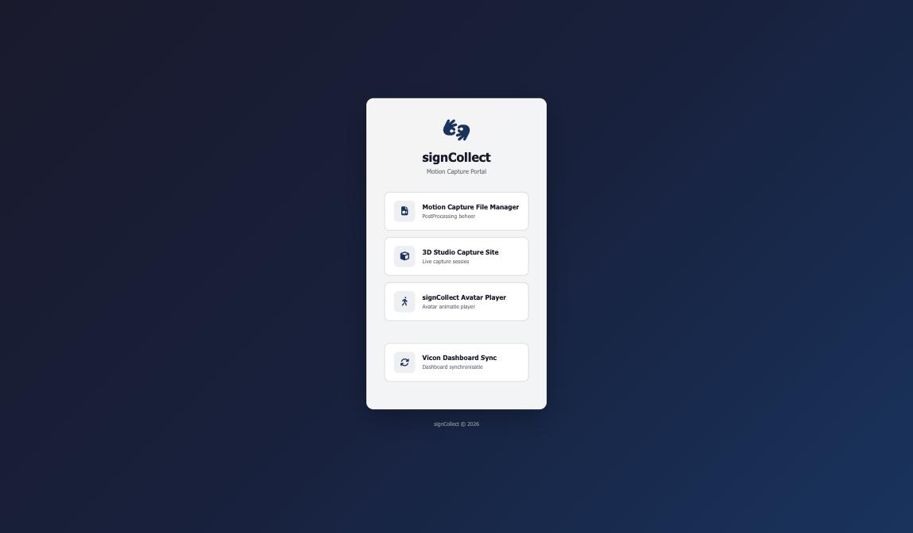
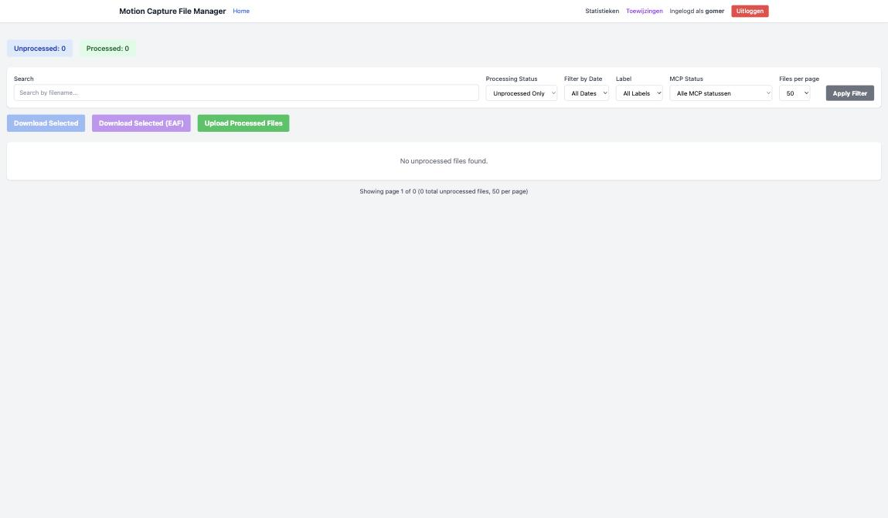
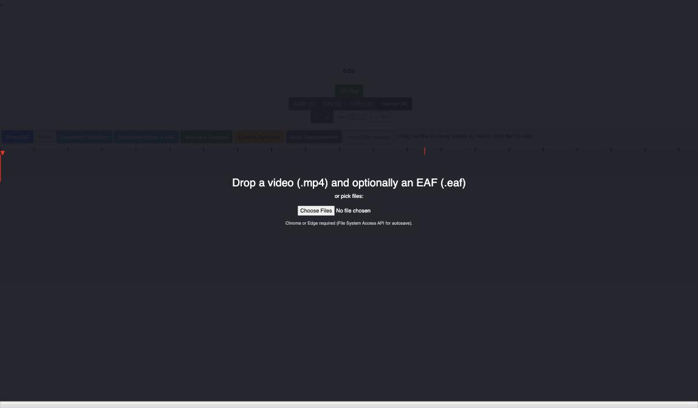
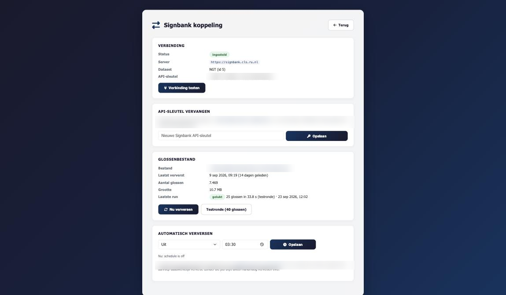

# Where to find what

Everything starts at **signcollect.nl**. The start page offers two doors:

| Card | Opens | Use it for |
|---|---|---|
| **signCollect interface (nieuw)** | `/menu_beta/` | Glosses, and the menu to every other tool |
| **Zinnen interface** | `/zin/zinnen.html` | Sentences (zinnen): status, videos, annotation |

## The main screen and its menu

The gloss list is the main screen. The **☰** button at the top left opens the menu
with every other tool. Your name and the log-out button are at the top right.

| Menu item | What you find there | Who uses it |
|---|---|---|
| **Gloss Wizard** | Step-by-step creation of a new gloss | Annotators |
| **Video crop fix** | Queue of takes where the automatic crop cut off the sign | Annotators, video team |
| **Studio videos** | The studio archive by date, all camera angles | Everyone |
| **Motion capture** | The motion-capture portal | Mocap team |
| **Sentences interface** | The Zinnen interface | Annotators |
| **NMM site** | Glosses still to record for non-manual markers (NMM) and OC | Recording team |
| **Health Holland interface** | Patient-information texts linked to NGT recordings | Health Holland project |
| **Video downloader** | Download videos by theme and/or label | Researchers |
| *Manage* → **Add labels** | Create, rename, recolour and delete labels | Editors |
| *Manage* → **Batch add** | Add many glosses at once, one per line | Editors |
| *Manage* → **Manage themes** | The list of themes | Editors |
| *Admin* → **Manage users** | Add users and change their role | Administrators |
| *Admin* → **Signbank koppeling** | The link with Signbank: test, API key, refresh the gloss list | Administrators |
| *Statistics* → **User activity** | Who did what, and the busiest pages | Administrators |
| *Account* → **Log out** | End your session | Everyone |

## Sentences (Zinnen interface)

The buttons at the top lead to the sentence tools; the coloured counters show how many
sentences are in each state. Filters narrow the list; **Reset Filters** clears them.

| Button | Opens |
|---|---|
| **ZNN App** | A sign-language browser: Dutch, sign-by-sign (Gebaar voor Gebaar) and gloss |
| **View Logs** | The change log |
| **Upload EAF** | Upload an ELAN annotation file |
| **Nieuwe Zinnen** | Add new sentences in batch |
| **Statistieken** | Activity timeline and statistics |
| **All Videos** | All sentence videos |
| **Overzicht** | Overview |

Each sentence row has its own buttons: **View Videos**, **Logboek**, **Download EAF**,
**Upload EAF**, **Bewerk EAF (AI)**, and the annotation editors.

## Recording (studio)

| Page | Opens | For |
|---|---|---|
| **Camera Control** | `/studio_beta/opnameView.html` | The operator during a recording session with the FX30 cameras |
| **Studio videos** | `/studioIndex/` | Checking a day's recordings: every take, every camera angle |
| **Video crop fix** | `/videoFix/` | Takes whose crop cut off the sign |

!!! warning "Camera Control settings"
    The settings menu contains **Starten Formatten**, which erases *all* cameras.
    Only use it after the day's videos are safely downloaded.

## Motion capture

The **Motion capture** menu item opens the portal with four doors.

| Card | For |
|---|---|
| **Motion Capture File Manager** | Download unprocessed recordings, upload cleaned (post-processed) files |
| **3D Studio Capture Site** | Live capture sessions: choose Glosses, HH, Sentences, BAK or the Capture List |
| **signCollect Avatar Player** | Play baked avatar animations |
| **Vicon Dashboard Sync** | See whether every Vicon capture arrived complete |

In the Vicon dashboard, **green** means a capture is complete (all five parts arrived),
**yellow** means it is still uploading, and **red** means parts are missing.

## Annotation tool

`/annotation-tool/v3/` is a browser editor for video and ELAN (EAF) annotation.
Drop a video (and optionally an EAF) on the page, or choose files. It needs **Chrome or Edge**
for autosave. Two modes: `?mode=webcam` and `?mode=clusters`.

## Health Holland

## Signbank link (administrators)

