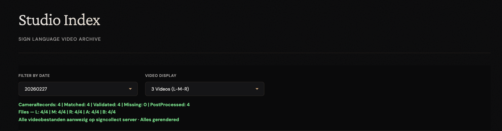

# Check that a day's recordings are complete

After a studio session, the takes go through several steps: download from the
cameras, copy to storage, QR scan, rendering, cropping and upload to
signcollect.nl (see [what happens next](recording-session.md#what-happens-next)).
This guide checks that every take of a day made it through.

Do this the day after the session. Processing takes a few hours.

## 1. Compare the counts

1. Open the [studio archive](../interfaces/studio-archive.md):
   <https://signcollect.nl/studioIndex/>.
2. Choose the date in **Filter by Date**. A status line appears under the
   filters.
3. Read the status line:

| Check | Good when |
|---|---|
| **CameraRecords** against **Matched** | About equal. Every take logged in Camera Control has its video on the server |
| **Missing** | 0, or close to it |
| **Matched** against **PostProcessed** | About equal. Every take is rendered and cropped |
| **Files — L / M / R / A / B** | Each angle you recorded with close to the matched count. Angles you did not use stay at 0 |

4. Look for the two confirmations: *Alle videobestanden aanwezig op
   signcollect server* and *Alles gerendered*. A difference of up to five
   takes still counts as complete.

<!-- screenshot: studio archive date status line with both confirmations, page /studioIndex/ -->

## 2. Look at the takes

1. Set **Video Display** to the angles you recorded: **3 Videos (L-M-R)**
   (the default) or **5 Videos (All)**.
2. Page through the takes. Check that each card has a gloss or sentence and
   that no angle shows *No video*.
3. Note any take where the sign is cut off at the edge. See
   [Fix a badly cropped take](fix-crop.md).

## 3. If something is missing

| What you see | Likely cause | What to do |
|---|---|---|
| **Matched** far below **CameraRecords** | Clips were not downloaded from the cameras, or not copied to storage yet | Check **Vandaag Opgenomen (Review)** in [Camera Control](../interfaces/camera-control.md) for **✗**. Download again if needed. Otherwise ask an administrator to check the copy on DRS |
| **PostProcessed** far below **Matched** | Rendering or cropping has not run, or failed | Wait a few hours and check again. If it stays low, ask an administrator |
| One angle you used (for example **R**) far below the others | One camera did not record or its clips were not copied | Ask an administrator |
| Cards without a gloss | The QR code in the video could not be read, so the take was not linked to its item. Check that the QR screen was visible to the cameras | Ask an administrator |

!!! tip "Is the pipeline running?"
    The [client monitor](../interfaces/client-monitor.md) shows whether the
    DRS jobs send heartbeats. If DRS jobs are **Offline**, nothing is
    processed until they run again.

## Related

- [Run a recording session](recording-session.md)
- [Studio archive](../interfaces/studio-archive.md)
- [Troubleshooting](../troubleshooting/index.md)
