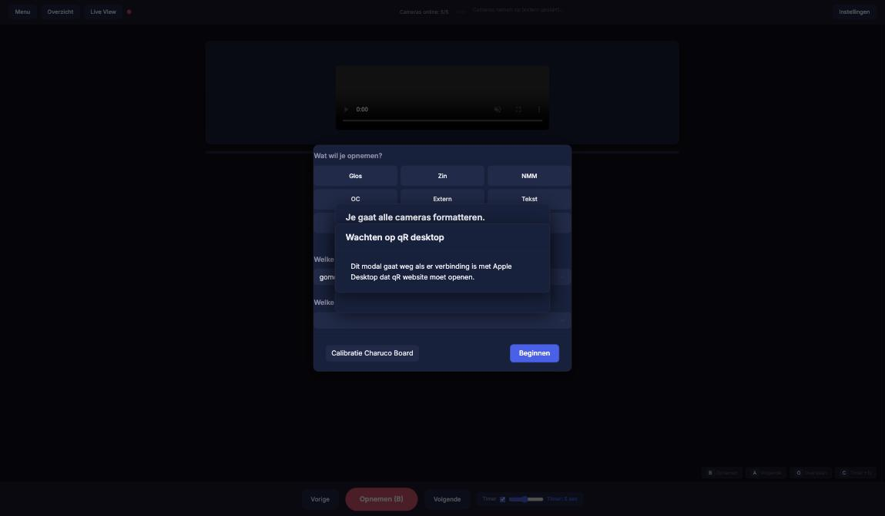

# Camera Control

Camera Control (camera-control) is the page the recording operator keeps open
during a studio session. It shows what to sign next, starts and stops all five
Sony FX30 cameras at once, and logs every take. It also downloads the clips
from the cameras at the end of the day.

The page talks to the camera controller on DRS, the studio Mac that the
cameras are connected to.

- **Who uses it:** recording operators, in the studio.
- **Address:** <https://signcollect.nl/studio_beta/opnameView.html>
- **Login:** yes.

!!! note "Only in the studio"
    The cameras are only reachable from the studio network. Elsewhere, and on
    demo hosts, the camera panel stays empty.

## Open it

1. Open <https://signcollect.nl/studio_beta/opnameView.html> on the studio
   computer.
2. The start window asks **Wat wil je opnemen?** (what do you want to record?).

<!-- screenshot: start window "Wat wil je opnemen?" with the type buttons, page /studio_beta/opnameView.html -->

## The screen

### Start window

1. **Wat wil je opnemen?** Choose the type: **Glos** (gloss), **Zin**
   (sentence), **NMM**, **OC**, **Extern**, **Tekst** (health text),
   **Labels**, **Begrippen** (glossary terms) or **Vrij opnemen** (free: you
   type what you will record).
2. **Welke gebruiker ben je?** Choose the signer's account.
3. **Welke thema wil je opnemen?** Choose the theme or list.
4. Click **Beginnen** (start). **Calibratie Charuco Board** starts a camera
   calibration first.

### Top bar

- The number of cameras online. It turns red when one is missing.
- **Menu:** back to the start window.
- **Overzicht:** what is still to record (*Nog te gaan*) and what is done (*Opgenomen*) in the current list.
- **Live View:** live images from the cameras. **Draai 90°** rotates the view.
- **Instellingen:** opens the side panel.

### Main area

The card in the middle shows the item to sign, with its reference video when
there is one. Below it:

- **Vorige** (previous), **Opnemen (B)** (record), **Volgende** (next).
- **Timer:** a countdown before each take.

<!-- screenshot: recording card with Opnemen (B) button and timer, page /studio_beta/opnameView.html -->

### Keyboard

| Key | Action |
|---|---|
| B | Start the take. Press again to stop |
| A | Next item |
| O | Skip this item |
| C | Timer one second longer (after 10 s it goes back to 1 s) |

### Side panel (Instellingen)

| Section | Buttons |
|---|---|
| Camera | **Charuco Board Calibratie**, **Camera Tabel (Probleemoplossing)** (camera table, for troubleshooting), **Live Streams Aan/Uit** |
| Opnames | **Vandaag Opgenomen (Review)**, **Starten Formatten** (format cards), **Start Downloaden Video's**, **Start Auto-Press B (20s)** |
| Timer | **Timer inschakelen** (turn the countdown on) |

## Common tasks

### Record a take

1. Check the top bar: all five cameras must be online.
2. Let the signer read the card.
3. Press **B**. With the timer on, a countdown runs first. The card turns red
   when the cameras record.
4. Press **B** again to stop. A stop within the first seconds is delayed: you
   see *Je hebt te snel op stop knop gedrukt* and the take stops by itself.
5. Press **A** for the next item.

### Record when a camera is missing

If a camera is offline, **B** shows *Niet alle cameras online!*. Check the
missing camera first. Click **Toch opnemen** (record anyway) only if you are
sure you can do without that angle. The next take asks again.

### Review today's takes

1. Open **Instellingen** and click **Vandaag Opgenomen (Review)**.
2. Click **Bekijk** to watch a take. **✓** means the clip was downloaded from
   the camera; **✗** means not yet.

### Download the clips at the end of the day

1. Check that every camera battery is at least 50% full.
2. Open **Instellingen** and click **Start Downloaden Video's**.
3. Confirm with **Ja, DOWNLOADEN**.
4. Keep the cameras connected while *Bezig met downloaden...* shows.

!!! danger "Formatting cannot be undone"
    **Starten Formatten** erases the memory cards of all cameras. Only format
    after the download has finished and every take shows **✓** in
    **Vandaag Opgenomen (Review)**. You are asked twice.

The full session checklist is in
[Run a recording session](../guides/recording-session.md).

## Messages you may see

| Message | Meaning |
|---|---|
| Downloaden bezig, opnemen kan niet... | A download is running. Wait until it ends |
| Scan of bestandslijst bezig, even wachten... | The controller is scanning for cameras. Cameras disappear for a moment; wait |
| Cameras nemen al op (extern gestart) | The cameras were started from somewhere else. Stop them there first |
| Een van de camera's reageert niet | A camera stopped answering. All takes were stopped. Check the cables and that the cameras are on |
| Let op, weinig geheugen of lage batterij! | A card is nearly full or a battery is low. After a battery change, calibrate again |
| Wachten op piep. | Waiting for the start beep. If it stays over 10 seconds, check that sound is on, at 60% volume or more |

## Related

- [Run a recording session](../guides/recording-session.md)
- [Check that a day's recordings are complete](../guides/check-day-complete.md)
- [Troubleshooting](../troubleshooting/index.md)
