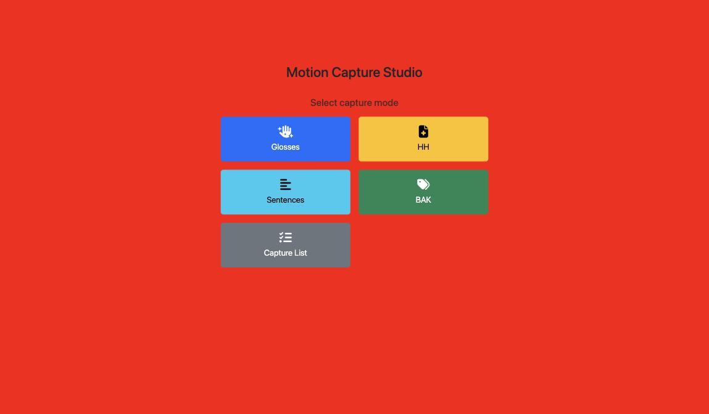

# Motion Capture Studio

The Motion Capture Studio page (mocapStudio, **3D Studio**) is used during a
Vicon motion-capture session. It shows the signer the next item, starts and
stops the recorder in Unreal, and logs every recording. It can also start the
copy of the day's recordings to the server.

- **Who uses it:** recording operators in the Visualisation Lab.
- **Address:** <https://signcollect.nl/mocapStudio/capture.html>
- **Login:** yes.

!!! tip "Use capture.html"
    Open `capture.html`. The older page `3dOpname.html` still exists but is not
    the one in use. The bare folder `/mocapStudio/` has no start page.

## Open it

- Go to <https://signcollect.nl/mocapStudio/capture.html>, or
- on the [mocap portal](mocap-portal.md), click **3D Studio Capture Site**.

<!-- screenshot: mode selection with Glosses, HH, Sentences, BAK and Capture List, page /mocapStudio/capture.html -->

## The screen

### Select capture mode

| Mode | What you record |
|---|---|
| Glosses | Single glosses, by video gloss, image gloss or topic |
| HH | Health texts |
| Sentences | Sentences (*zinnen*) |
| BAK | Items from the *Basiswoordenlijst Amsterdamse Kleuters* (BAK), a basic word list for young children |
| Capture List | The list of what still needs recording, per theme. You can pick an item, record a whole theme, or mark an item as captured |

### Recording screen

- **Back:** return to mode selection.
- **Manual Sync:** copy the recordings to the server now (see below).
- Operator buttons: **Close UE**, **Broadcast Gloss**, **Export LSN**,
  **Custom Gloss**, **Custom Command**. These send commands to Unreal. Use them
  only when the session lead asks you to.
- Counters: how many items are left, and how many were recorded today.
- **Duration** slider (3 to 15 seconds, 5 by default): how long a capture
  runs. The capture stops by itself after this time. Tick **1000s** to turn
  the automatic stop off and stop by hand.
- The large text in the middle is the item to sign.
- A 3D preview of the reference animation.

### Keyboard

| Key | Action |
|---|---|
| A | Start the capture (after one second). Press again to stop early |
| B | Save the capture and go to the next item |
| C | Skip this item |
| X | Leave theme batch mode |

## Common tasks

### Record an item

1. Choose a mode and an item.
2. Set **Duration** to a bit longer than the item takes to sign.
3. Press **A**. The capture starts after one second and stops by itself when
   the duration is over. Press **A** again to stop earlier.
4. Press **B** to save and go to the next item, or **C** to skip.

### Copy today's recordings to the server now

The server copies new recordings from the Vicon PC every night, at about 02:30. To do it
straight after a session:

1. Click **Manual Sync**.
2. Click **Yes, sync now**.
3. The window shows *Triggering sync...*, then *Sync started. Fetching
   status…* and the live status. It keeps checking for about ten minutes. On
   an error, the button changes to **Retry**.
4. Check the result on the [Vicon dashboard](vicon-dashboard.md).

## Related

- [Get mocap from Vicon to a baked animation](../guides/mocap-to-animation.md)
- [Vicon dashboard](vicon-dashboard.md)
- [Troubleshooting](../troubleshooting/index.md)
