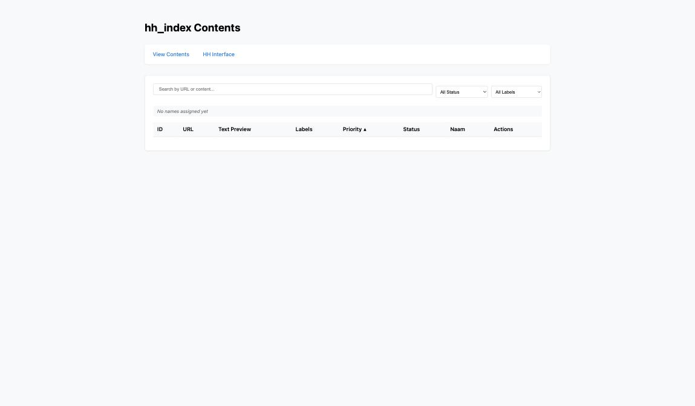

# Patient-info texts

The patient-info interface (patient-info, **Health Holland Interface**) holds
Dutch patient-information texts from thuisarts.nl and apotheek.nl. It links
their topics, sentences and words to NGT recordings, so you can see which
texts have been signed and annotated.

!!! note "Dormant project"
    This project is not active. The pages still work and are kept online.
    The tool that collected new texts has been removed.

- **Who uses it:** researchers of the health-information project.
- **Address:** <https://signcollect.nl/hh/>
- **Login:** yes.

## Open it

- Go to <https://signcollect.nl/hh/index.html>, or
- in the [gloss management](main-menu.md) menu, choose **Health Holland
  Interface**.

<!-- screenshot: HH dashboard, page /hh/index.html -->

## The screen

| Page | Address | What it shows |
|---|---|---|
| Dashboard | `/hh/index.html` | The start page |
| Contents | `/hh/contents.html` | The topics and their texts |
| Words Statistics | `/hh/words.html` | How often each word occurs |
| Sentences Statistics | `/hh/sentences.html` | The sentences of the texts |
| Begrippenlijst | `/hh/begrippenlijst.html` | The glossary of health terms |
| HH Index Overview | `/hh/overview_hh.html` | Which topics have video, segments and annotations |

**HH Index Overview** works like the [Zinnen interface](zinnen.md): it has
filters, status drop-downs, **View Logs** and **Upload EAF**. Its edit button
opens the subBeta8 [annotation editor](annotation-editors.md).

## Common tasks

### Find which health texts are annotated

1. Open **HH Index Overview**.
2. Filter on the status you need.
3. Click the edit button on a row to open it in subBeta8.

### Record health texts in the studio

In [Camera Control](camera-control.md), choose **Tekst** or **Begrippen** in
the start window. The texts come from this interface.

## Related

- [Zinnen interface](zinnen.md)
- [Troubleshooting](../troubleshooting/index.md)
