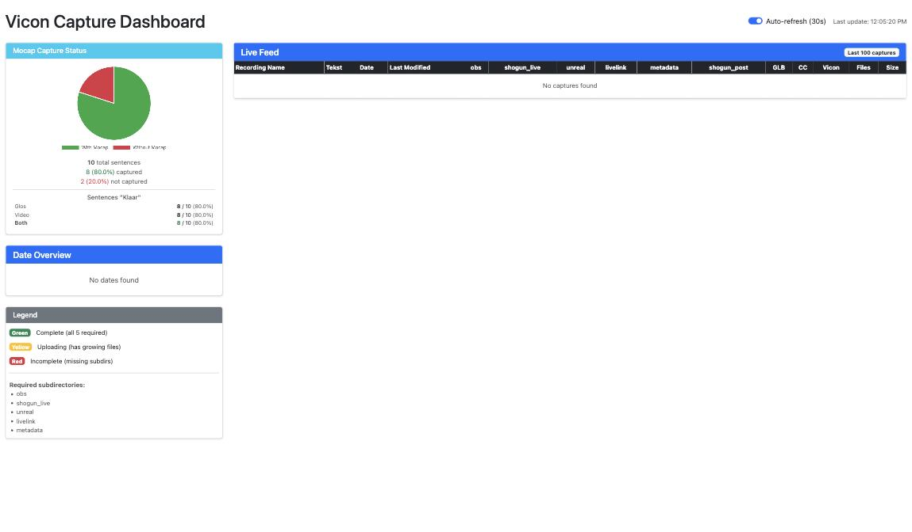

# Vicon dashboard

The Vicon dashboard (viconDashboard, **Vicon Capture Dashboard**) shows which
motion-capture recordings have arrived on the server, whether their files are
complete, and download links for them.

- **Who uses it:** the mocap team, after and during a session.
- **Address:** <https://signcollect.nl/viconDashboard/>
- **Login:** yes.

## Open it

- Go to <https://signcollect.nl/viconDashboard/>, or
- on the [mocap portal](mocap-portal.md), click **Vicon Dashboard**.

<!-- screenshot: Vicon Capture Dashboard with date overview and live feed, page /viconDashboard/ -->

## The screen

### Header

**Auto-refresh (30s)** reloads the data every 30 seconds. **Last update**
shows when it last did.

### Mocap Capture Status

A pie chart of the mocap state of the sentences, and the number of sentences
marked *Klaar*.

### Date Overview

The last 30 recording dates. Click a date to see only its recordings.
**Clear filter** shows all recordings again.

### Live Feed

The last 100 recordings, or those of the chosen date. One row per recording:

| Column | What it is |
|---|---|
| Recording Name | The recording, as named on the Vicon PC |
| Tekst | Link to the text that was signed |
| Date, Last Modified | When it was recorded and last changed |
| obs | Video recordings |
| shogun_live | Motion-capture data |
| unreal | Unreal Engine exports |
| livelink | LiveLink CSV data |
| metadata | JSON metadata |
| shogun_post | Post-processed Shogun data |
| GLB | Whether a GLB exists |
| CC, Vicon | The CC and Vicon FBX exports |
| Files, Size | Number of files and total size |

### Row colours

| Colour | Meaning |
|---|---|
| Green | Complete: *obs*, *shogun_live*, *unreal*, *livelink* and *metadata* are all there |
| Yellow | All five are there, but files are still being copied |
| Red | Incomplete: at least one of the five is missing |

*shogun_post*, *GLB*, *CC* and *Vicon* are shown but do not change the colour.
Files that stay on the Vicon PC show as present but have no download link.

!!! note "The Tekst link"
    The **Tekst** link opens the 3D viewer: the capture played on the same
    avatar the 3DAnn3 editor uses.

## Common tasks

### Check a session arrived

1. Wait for the nightly copy, or use **Manual Sync** on the
   [Motion Capture Studio](mocap-studio.md) page.
2. Click the session date in **Date Overview**.
3. Check that every row is green. Yellow rows are still copying: wait and
   refresh.
4. For a red row, note the recording name and which column is missing, and
   tell an administrator.

### Download a file

1. Click the row. Its list of files opens.
2. Click the file. Only files that were copied to the server have a link.

## Related

- [Get mocap from Vicon to a baked animation](../guides/mocap-to-animation.md)
- [Motion Capture Studio](mocap-studio.md)
- [Troubleshooting](../troubleshooting/index.md)
