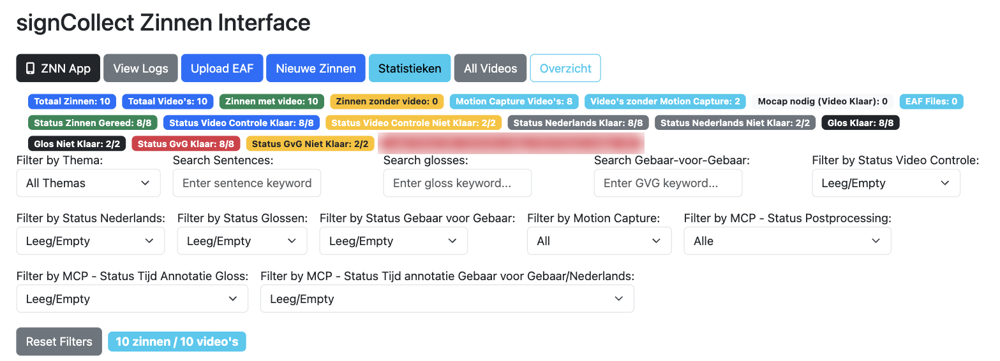

# Zinnen interface

The Zinnen interface (zinnen-annotation) is where annotators work on signed
sentences (*zinnen*). It lists every sentence with its studio videos, the
status of each annotation tier and of its motion-capture take. From here you
open a video in an [annotation editor](annotation-editors.md), and you
download or upload its EAF file.

- **Who uses it:** annotators, every day.
- **Address:** <https://signcollect.nl/zin/zinnen.html>
- **Login:** yes.

## Open it

- On the start page after login, click **Zinnen interface**, or
- in the [gloss management](main-menu.md) menu, choose **Zinnen Interface**.

You now see the filters and the sentence list, 25 sentences per page.

<!-- screenshot: Zinnen interface with filters and first sentence rows, page /zin/zinnen.html -->

## The screen

### Top buttons

- **ZNN App:** a sign-language browser (Dutch, sign by sign, gloss).
- **View Logs:** the action log (who did what, and when). You can filter it.
- **Upload EAF:** upload an EAF file that is not tied to a row yet.
- **Nieuwe Zinnen:** add new sentences in batch.
- **Statistieken:** activity timeline and statistics.
- **All Videos:** all sentence videos.
- **Overzicht:** statistics on all sentences.

### Filters

| Filter | What it does |
|---|---|
| Filter by Thema | Show one theme |
| Search Sentences | Words in the Dutch sentence |
| Search glosses | A gloss in the Signbank gloss tier |
| Search Gebaar-voor-Gebaar | Text in the sign-by-sign tier |
| Filter by Status Video Controle | *Niet Klaar*, *Klaar* or *Niet voor app, verplaatsen naar Signbank* |
| Filter by Status Nederlands | Dutch translation: *Niet Klaar*, *Klaar* or *Controle nodig* |
| Filter by Status Glossen | Gloss tier: *Niet Klaar*, *Klaar* or *NVT* |
| Filter by Status Gebaar voor Gebaar | Sign-by-sign tier: *Niet Klaar*, *Klaar* or *Check nodig* |
| Filter by Motion Capture | *Has Motion Capture* or *No Motion Capture* |
| MCP status filters | Post-processing and time annotation of the mocap take |

!!! note "Leeg/Empty means no filter"
    In the status filters, **Leeg/Empty** (the default) switches the filter
    off: you see every sentence, not only those with an empty status. There is
    no way to filter on an empty status.

**Reset Filters** clears all filters. **Reset All Status to empty**, below the
list, only clears the status filters; it does not change any sentence.

### A sentence

Each sentence has, on the left:

- The sentence text. You can correct it in place; it saves when you leave the
  field.
- A comments field (*Add comments...*). It saves when you leave the field.
- The status drop-downs for this sentence: **Status Video Controle**, **Status
  Nederlands**, **Status Glossen**, **Status Gebaar voor Gebaar** and the three
  MCP statuses. A change saves at once.
- **View Videos** (all angles, with **Play All Videos**), **Delete Sentence**
  and **Logboek**.

On the right is one block per video, with a thumbnail, a table with the number
of items in each EAF tier (**EAF Signbank Glossen**, **EAF Nederlands**, **EAF
Gebaar voor Gebaar**), and these buttons:

| Button | What it does |
|---|---|
| **Verplaatsen naar nieuwe zin** | Move this video to a new sentence |
| **Download EAF (MP4)** | Download the EAF file |
| **Download** | Download the videos of this take (middle, A and B) as `videos.zip`, with an SRT file per tier |
| **Upload EAF** | Replace the annotation with an EAF file from your computer, for example one you edited in ELAN |
| **Delete video** | Remove the video from this sentence |
| **Bewerk EAF (AI)** | Open the video in the subBeta8 [annotation editor](annotation-editors.md) |
| **Bewerk Motion Capture** | Open the mocap take in the 3DAnn3 editor (see below) |
| **Delete EAF** | Delete the annotation. Only active when there is an EAF |

The motion-capture button only appears when the sentence has a mocap take and
**MCP - Status Postprocessing** is *Klaar*. It reads **Motion Capture
blocked** until **Status Nederlands**, **Status Glossen** and **Status Gebaar
voor Gebaar** are all *Klaar*.

## Common tasks

### Find your next sentence

1. Choose your theme in **Filter by Thema**.
2. Set the status filter of the tier you work on, for example **Filter by
   Status Nederlands**, to *Niet Klaar*.
3. Pick the first sentence.

### Annotate a sentence

1. Click **Bewerk EAF (AI)** on the video.
   You now see the subBeta8 editor with the video and three tiers.
2. Annotate. The editor saves by itself.
3. Set the status of the tier you finished to *Klaar*, in the editor or back
   in the list.
4. Click **Go back to Zinnen**.
   You return to the list with your filters still set.

The full workflow is in [Annotate a sentence and save the EAF](../guides/annotate-sentence.md).

### Work on an EAF in ELAN

1. Click **Download EAF (MP4)** to get the EAF.
2. Click **Download** to get the videos, and unzip them.
3. Open the EAF in ELAN, with the video, and edit.
4. Click **Upload EAF** on the same video, choose your file and click
   **Upload**.

*EAF file uploaded successfully.* confirms it.

### Record why a sentence is not done

Type in the comments field of the sentence. It saves when you leave the field.

## Related

- [Annotation editors](annotation-editors.md)
- [Annotate a sentence and save the EAF](../guides/annotate-sentence.md)
- [Export and download annotations](../guides/export-annotations.md)
- [Troubleshooting](../troubleshooting/index.md)
