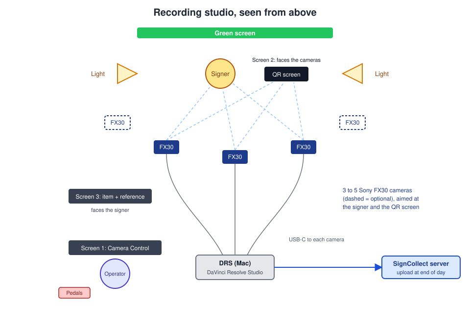

# Physical setup

How to place the cameras, green screen, lights, screens and pedals. Where the
code sets a rule, this page says so. Where it does not, the advice is general
studio practice: adjust it to your room.

## Green screen and lights

1. Hang the green screen behind the signer, wide and tall enough to fill the
   background of every camera, including the left and right ones.
2. Light the green screen evenly, without shadows or hot spots. DaVinci
   Resolve keys out the green (a Delta Keyer in the Fusion composition), and
   uneven green leaves patches behind.
3. Light the signer separately from the front, so the hands are sharp and not
   in shadow. The cropping step looks for the signer's pose; poor light
   causes failed or bad crops.
4. Keep a gap between the signer and the green screen, so no green light
   falls on the signer.

!!! tip
    Green that is left in a processed video can be painted out later with
    Background Fix, but a clean key saves that work.

## Cameras

1. Place the middle camera (`M`) straight in front of the signer.
2. Place the left (`L`) and right (`R`) cameras at an angle on each side.
   These three are required: the pipeline renders and crops only `L`, `M`
   and `R`.
3. Place the extra cameras (`A`, `B`) where you want more angles.
4. Frame the signer from above the head to below the waist, with room for
   the hands on both sides. The render outputs a portrait video
   (2160 × 3840); frame for portrait.
5. Make sure **every camera also sees the QR screen**. The QR code is how
   each take is linked to its item. The QR reader looks at the middle frame
   of each clip; its fallback for partly visible codes searches the lower
   right of the frame, so that is a good place for the QR screen in the
   picture.
6. Set the clip name of each camera so its files start with its position
   letter and the date, for example `M20251001_2313.MP4`. The pipeline reads
   the camera and the date from the file name. See
   [camera settings](install-drs.md#camera-settings).

## Cables

1. Connect each camera to the studio Mac (DRS) with a USB-C data cable.
   Direct to the Mac, or through a powered USB hub.
2. Connect mains power or keep charged batteries at hand. A download at the
   end of the day needs at least 50% battery.
3. Connect the Mac to the wired network (ethernet port `en0`).
4. Optional: connect a camera's HDMI output to the Elgato HD60, and the Elgato
   to the Mac by USB. Camera Control uses it for the live view.

## Screens

DRS drives three screens:

| Screen | Shows | Notes |
|---|---|---|
| 1. Operator | Camera Control and the controller app | The Mac's main display |
| 2. QR screen | The QR page `opnameLR.html`, full screen | Faces the cameras. Must be an **extended** display, not mirrored |
| 3. Signer | The item to sign and its reference video | Facing the signer. It can mirror the operator screen |

The controller app opens the QR page by itself: full screen, in a separate
Chrome window, on the screen whose macOS name contains `display_screen` from
its `config.json` (default `PHL`). A mirrored display never shows up as its
own screen, so the QR screen must be set to extend the desktop.

1. Open **System Settings** > **Displays**.
2. Set the QR screen to extend the desktop (not mirror).
3. Note part of its name (for example `PHL` for a Philips monitor) and put it
   in `display_screen` in the controller's `config.json`.
4. Place the QR screen so all cameras can see it, close enough that the code
   is sharp in the camera image.
5. If the QR page did not open, click **🖥 QR-scherm openen** in the
   controller app. The status next to it shows **QR-scherm: ● open**.

!!! note "Waiting for the QR screen"
    Camera Control shows *Wachten op qR desktop* until the QR page has
    answered through the studioSupport server. When the page is open, the
    message goes away by itself.

## Foot pedals

This part is general: the code has no pedal settings. Camera Control reacts
to key presses, so any USB foot pedal that can send a key works.

1. Program one pedal to send **B** (start a take, press again to stop).
2. Program a second pedal to send **A** (next item), if you use two.
3. Keep Camera Control the active window. The keys do nothing while the
   cursor is in a text field.

## Related

- [Requirements](requirements.md)
- [Install the DRS Mac](install-drs.md)
- [The capture day](workflow.md)
- [Camera Control](../interfaces/camera-control.md)
