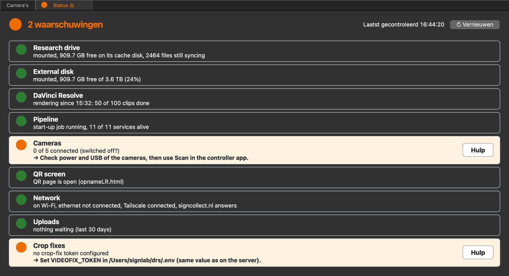

# Studio troubleshooting

Start here when something in the recording studio does not work. Look at
the Status tab first; the table after it sends you to the right page. The
rest of this page covers problems while **setting up** a studio.

## Look at the Status tab first

The controller app on the studio Mac (*FX30 Multi-Camera Bediening*) has a
**Status** tab. It checks the studio every minute and shows one light per
part: green is fine, orange needs attention, red is broken. The tab itself
turns orange or red and shows **⚠** when something is not green, so you see
it from the **Camera's** tab too.



1. Open the controller app and click the **Status** tab.
2. Read the rows that are not green. The line with **→** says what to do.
3. Click **Hulp** on that row. It opens the entry on this page (or the
   camera page) that belongs to it.
4. Click **↻ Vernieuwen** to check again straight away.

| Row | Green when | If not, see |
|---|---|---|
| Research drive | It is mounted and readable, with room on its cache disk | [The research drive is not mounted](#studio-research-drive) |
| External disk | `cacheDisk` is mounted and more than 15% is free | [The external disk is not found](#studio-cachedisk) |
| DaVinci Resolve | The last hourly batch finished without errors. While a batch runs, it shows how many clips are done | [DaVinci Resolve does not render](#studio-resolve) |
| Pipeline | The start-up job and all its services are running | [The pipeline does not start](#studio-pipeline-start) |
| Cameras | Every camera is connected. Orange with all cameras off is normal outside a session | [Troubleshooting FX30 connections](troubleshooting-fx30.md) |
| QR screen | The QR page is open | [The QR screen does not open](#studio-qr-screen) |
| Network | The Mac is online, Tailscale is connected and the SignCollect server answers | [Camera Control cannot reach the cameras](#studio-camera-server) |
| Uploads | No recording has waited more than a day to be uploaded | [Takes never arrive on the server](#studio-no-upload) |
| Crop fixes | The server accepts the Mac's crop-fix token | [Crop fixes are no longer picked up](../troubleshooting/video-processing.md#vp-crop-token) |

Resolve is judged by its last batch, not by whether it is open: the pipeline
starts and stops Resolve every hour.

!!! tip "For administrators: the same list over ssh"
    The tab runs a small read-only program that you can also run yourself:

    ```bash
    /usr/bin/python3 /Users/signlab/drs/tools/health.py
    ```

    It prints the same nine lines with what to do, and exits with 0 (all
    fine), 1 (warnings) or 2 (problems). Add `--json` for scripts. If the tab
    says *health.py niet gevonden*, that file is missing from the pipeline
    folder: update the pipeline, see [Install the DRS Mac](install-drs.md).

## What is wrong?

| What you see | Go to |
|---|---|
| A camera is missing, offline or not responding | [Troubleshooting FX30 connections](troubleshooting-fx30.md) (IT), or [Recording: cameras offline](../troubleshooting/recording.md#rec-cameras-offline) (operator) |
| *Camera controller niet bereikbaar* | [Recording: controller unreachable](../troubleshooting/recording.md#rec-controller-unreachable) |
| Camera Control stays on *Wachten op qR desktop* | [The QR screen does not open](#studio-qr-screen) below |
| Camera Control stays on *Wachten op piep* | [Recording: waiting for the beep](../troubleshooting/recording.md#rec-waiting-beep) |
| Battery, card or overheating warnings | [Recording: battery](../troubleshooting/recording.md#rec-battery), [overheating](../troubleshooting/recording.md#rec-overheat) |
| A take is not downloaded (✗), or not linked to its gloss | [Recording: not downloaded](../troubleshooting/recording.md#rec-not-downloaded), [QR not linked](../troubleshooting/recording.md#rec-qr-not-linked) |
| Nothing from today is processed or uploaded | [Video processing: pipeline stopped](../troubleshooting/video-processing.md#vp-pipeline-stopped) |
| Videos are cropped badly, or the green screen is still green | [Video processing](../troubleshooting/video-processing.md#vp-bad-crop) |
| Clips are not on the research drive | [Video processing: not copied](../troubleshooting/video-processing.md#vp-not-copied) |
| A problem while installing the studio | The sections below |

## Setting up the studio

These entries follow the order of [Install the DRS Mac](install-drs.md).
"The controller app" is the SignCollect studio app on the Mac; its window is
called *FX30 Multi-Camera Bediening*.

### The setup script warns or stops {#studio-setup-script}

**Who can fix:** administrator

**Likely cause:** something the script needs is missing on the Mac. The
script names it in a line that starts with `warn`.

**Try this:**

1. Run the script without `--apply`. It then only reports and changes
   nothing:

    ```bash
    cd /Users/signlab/drs && scripts/setup-drs.sh
    ```

2. Fix each warning, then run it again. The common ones:

    | Warning | Fix |
    |---|---|
    | Xcode is missing | Install the full Xcode app from the App Store, open it once and accept the licence |
    | Homebrew is not installed | Install Homebrew, see <https://brew.sh> |
    | DaVinci Resolve Studio is not installed | Install the **Studio** (paid) edition, see below |
    | Tailscale is not installed | Install Tailscale and log in to the server's tailnet |
    | Google Chrome is not installed | Install Chrome |
    | `cacheDisk` is not mounted | See [the external disk](#studio-cachedisk) below |
    | no rclone remote `signcollect:` | See [the research drive](#studio-research-drive) below |
    | `VIDEOFIX_TOKEN` is not set | Run the script as `VIDEOFIX_TOKEN=<token> scripts/setup-drs.sh --apply`, with the token from the server's `.env` |

3. When the report is clean, run it with `--apply`.

**Still stuck?** Send the full output of the script.

### DaVinci Resolve does not render {#studio-resolve}

**Who can fix:** administrator

**Likely cause:** the pipeline drives Resolve through its scripting
interface. That needs the Studio edition, scripting switched on, and the
project the pipeline expects.

**Try this first:**

1. Restart the Mac mini and log in again. Wait half an hour: the pipeline
   then starts Resolve by itself.
2. If it still does not start, check that the research drive is connected,
   see [the research drive](#studio-research-drive). The pipeline waits for
   it, and its password or API key may have been changed.

**If that does not help:**

1. Check that the installed edition is DaVinci Resolve **Studio**. The free
   edition has no external scripting.
2. Open Resolve > **Preferences** > **System** > **General** and set
   **External scripting using** to **Local**. Restart Resolve.
3. Check that a project named `lala6` exists. The pipeline opens it by name.
4. Close Resolve. The pipeline starts and stops it by itself every hour, and
   a Resolve you opened by hand gets killed mid-work.
5. Read `~/drs/logs/batch.log` for the error.

**Still stuck?** Send the last 50 lines of that log.

### The QR screen does not open, or opens on the wrong screen {#studio-qr-screen}

**Who can fix:** administrator

**Likely cause:** the controller app opens the QR page on the screen whose
macOS name contains the `display_screen` text in its `config.json`. If that
screen is mirrored, or the name does not match, it has nowhere to go.
Camera Control then stays on *Wachten op qR desktop*.

**Try this first:**

1. Click **🖥 QR-scherm openen** in the controller app.
2. If the QR page still does not show, right-click the Chrome icon in the
   Dock and look at the list of open windows. The QR page may be open on
   the wrong screen: click it and drag it to the external monitor.

**If that does not help:**

1. Open **System Settings** > **Displays** and set the QR screen to
   **extend** the desktop, not mirror it.
2. Note part of that screen's name, for example `PHL` for a Philips monitor.
3. Put it in `display_screen` in
   `~/signlab_Sony-SDK-MACOS-API/pyqtController/config.json`.
4. Restart the controller app, or click **🖥 QR-scherm openen** in it. The
   status next to the button shows **QR-scherm: ● open**.
5. Check that the cameras can see the screen and that the code is sharp in
   the camera image.

**Still stuck?** The QR page reaches Camera Control through the
studioSupport service on the SignCollect server, and that service may be
offline. An administrator can check it over ssh on the server:

```bash
systemctl status studio-support
```

### Camera Control warns "Niet alle cameras online" with every camera on {#studio-camera-list}

**Who can fix:** administrator

**Likely cause:** a camera lost its USB connection, or Camera Control counts
against the wrong camera list. Without a `cameras.json` it expects the lab's
five cameras, by serial number.

**Try this first:**

1. Turn all cameras off, wait one minute, and turn them on again.
2. Check every USB cable, at the camera and at the Mac.
3. Restart the controller app.
4. If a camera is still missing: turn the cameras off, restart the Mac
   mini, start the controller app, and only then turn the cameras on.

**If the count itself is wrong** (a studio with fewer or other cameras):

1. On the Mac, read the serials: `curl -s localhost:8080/api/status`. The
   serial is the ID in brackets in `"model"`.
2. On the server, create `cameras.json` next to `opnameView.html` with
   exactly your cameras. See
   [Install the DRS Mac](install-drs.md#camera-control-and-the-server).
3. Reload Camera Control. The top bar now counts against your cameras.

### Camera Control cannot reach the cameras of a new studio {#studio-camera-server}

**Who can fix:** administrator

**Likely cause:** the server reaches the camera server on the Mac over
Tailscale, at a fixed name.

**Try this:**

1. Do the four steps under
   [Camera Control warns "Niet alle cameras online"](#studio-camera-list)
   first.
2. On the Mac, open <http://localhost:8080>. If no page loads, the camera
   server is not running: start the controller app.
3. Check that the Mac and the server are in the same tailnet
   (`tailscale status` on both).
4. Open Camera Control with `?camhost=<the Mac's Tailscale name>:8080`. If
   that works, set that name as `$DEFAULT_HOST` in `fx30proxy.php` on the
   server.

**Still stuck?** Follow
[Troubleshooting FX30 connections](troubleshooting-fx30.md) from step 3.

### The external disk is not found {#studio-cachedisk}

**Who can fix:** administrator

**Likely cause:** camera downloads and the rclone cache go to
`/Volumes/cacheDisk`. The disk is not connected, has another name, or is
broken.

**Try this:**

1. Check the disk's cable and power, and that it shows in Finder.
2. Open **Disk Utility** and select the disk. Run **First Aid** to see
   whether it still works or is corrupted.
3. If the disk is broken, replace it: format the new disk and name it
   exactly `cacheDisk`.
4. Check the name: `ls /Volumes/cacheDisk`. If the disk has another name,
   rename it (Finder > select the disk > Return).
5. After a new or reformatted disk, run `scripts/setup-drs.sh --apply`. It
   creates the folders on the disk.

### The research drive is not mounted {#studio-research-drive}

**Who can fix:** administrator

**Likely cause:** the rclone remote is missing, macFUSE is not allowed, or
the mount is still starting. The pipeline needs this mount: all its paths
are under it.

**Try this first:**

1. Check the internet connection of the Mac.
2. Check that the research drive's own website can be reached.
3. Check the API key (app password) of the research drive. It belongs to
   one person's UvA account, at the moment Gomer Otterspeer's. If that
   account or its password changed, the key stops working and must be
   replaced: run `rclone config` and update the remote `signcollect:`.
4. Check that rclone is up to date: `~/rclone/rclone version`.
5. Check that macFUSE is installed, allowed and up to date, in **System
   Settings** > **Privacy & Security** and **System Settings** >
   **macFUSE**.

**If that does not help:**

1. Check the remote exists: `rclone listremotes` must list `signcollect:`.
   If not, run `scripts/setup-drs.sh --apply --rclone`.
2. Open **System Settings** > **Privacy & Security** and allow the macFUSE
   system extension. Restart the Mac if it asks.
3. Check the mount:

    ```bash
    ls "$HOME/signCollect/AIHR-FGW-TEST-SIGNLAB (Projectfolder)/do_not_remove_for_rclone"
    ```

4. If the file is not there, wait. The health check only starts 30 minutes
   after rclone starts.
5. Check that the marker file `do_not_remove_for_rclone` and the folder
   `studioFiles` exist on the research drive itself.

**Still stuck?** Send `~/drs/startup.log`.

### The pipeline does not start after logging in {#studio-pipeline-start}

**Who can fix:** administrator

**Likely cause:** the start-up job did not run, or it stopped on the mount
check above.

**Try this:**

1. Check the Python environment the pipeline uses:
   `/usr/bin/python3 --version` must answer. If it does not, install the
   command line tools: `xcode-select --install`.
2. Start the pipeline by hand in Terminal, from its own folder:

    ```bash
    cd /Users/signlab/drs
    nohup /usr/bin/python3 startupScript.py > /dev/null 2>&1 &
    ```

    On a Mac installed with the setup script you can also use
    `launchctl kickstart gui/$(id -u)/nl.signcollect.drs-startup`.
3. Check that it runs: `ps -p $(cat ~/drs/startup.pid)`.
4. Read `tail -50 ~/drs/startup.log` for the reason if it stops again.
5. Open the [client monitor](../interfaces/client-monitor.md). The `drs-*`
   clients should send heartbeats within a few minutes.

### Takes are recorded but never arrive on the server {#studio-no-upload}

**Who can fix:** administrator

**Likely cause:** the pipeline uploads to the address in `SIGNCOLLECT_URL`.
It is wrong, or the pipeline is not running.

**Try this:**

1. Check that the pipeline and its scripts are running:

    ```bash
    ps -p $(cat ~/drs/startup.pid)
    pgrep -fl "convertFiles|moveFiles|batch_queue|crop.py"
    ```

2. If they are not, start the pipeline by hand, see
   [above](#studio-pipeline-start).
3. Look at what each script last did:

    ```bash
    tail -20 ~/drs/logs/convertFiles.log
    tail -20 ~/drs/logs/moveFiles.log
    tail -20 ~/drs/logs/batch.log
    ```

4. Check the server address: `grep SIGNCOLLECT_URL ~/drs/.env`. Without
   that line the pipeline uploads to `https://signcollect.nl`.
5. Check the Mac reaches the server: `curl -sI https://signcollect.nl | head -1`.
6. Follow one take: see
   [Video processing: nothing is processed](../troubleshooting/video-processing.md#vp-pipeline-stopped)
   and [a clip was never rendered](../troubleshooting/video-processing.md#vp-never-rendered).

## Related

- [Install the DRS Mac](install-drs.md)
- [Troubleshooting FX30 connections](troubleshooting-fx30.md)
- [Troubleshooting: recording sessions](../troubleshooting/recording.md)
- [Troubleshooting: video processing](../troubleshooting/video-processing.md)
